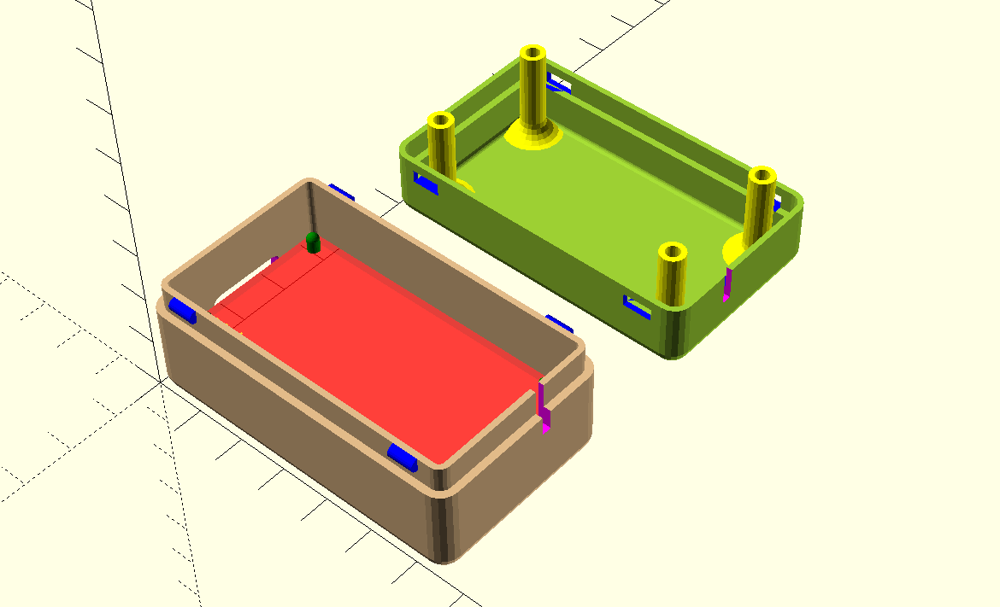
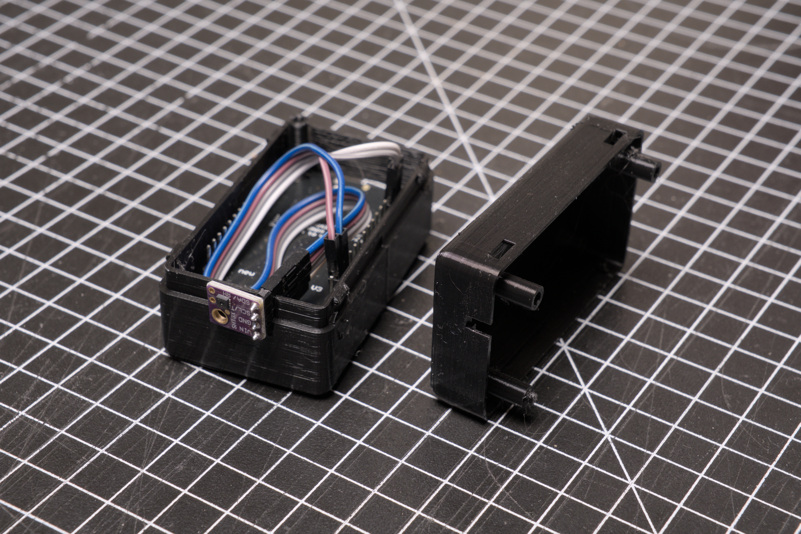
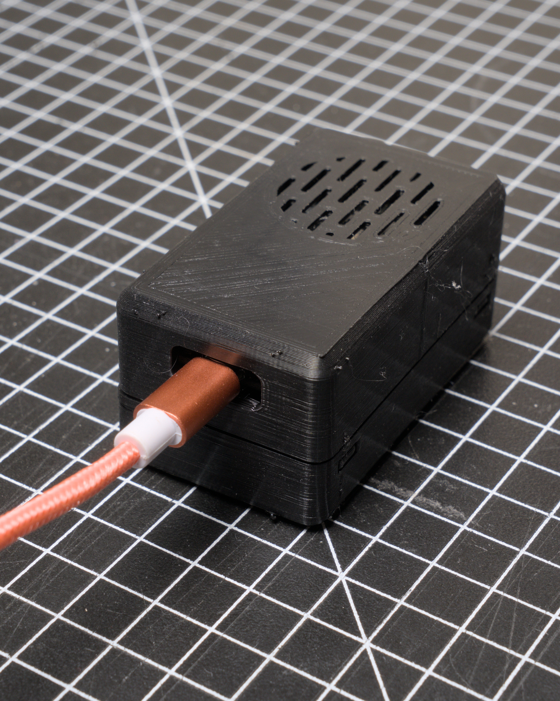
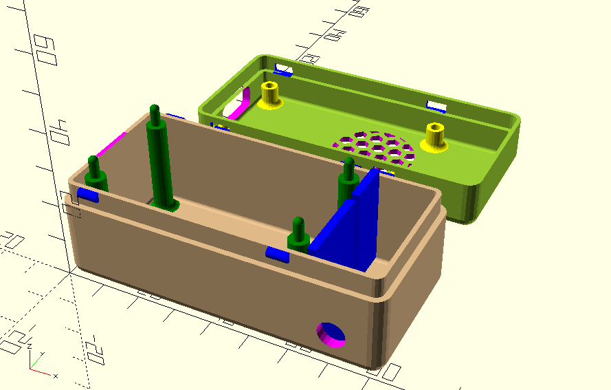
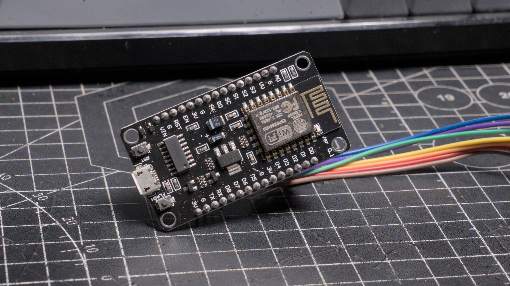

# My Home Assistant Sensors
## Cases

- [My Home Assistant Sensors](#my-home-assistant-sensors)
  - [Cases](#cases)
    - [NodeMCU v3 with Generic Sensor (External)](#nodemcu-v3-with-generic-sensor-external)
    - [NodeMCU v3 with SHT30-D](#nodemcu-v3-with-sht30-d)
  - [The MCU's I'm using](#the-mcus-im-using)
    - [NodeMCU v3 (ESP3266)](#nodemcu-v3-esp3266)
  - [Dependencies](#dependencies)

### NodeMCU v3 with Generic Sensor (External)
A case for a NodeMCU v3 with a slot for external sensors. I recommend pulling the sensor a bit away from the case.

### NodeMCU v3 with SHT30-D
NEEDS MODIFICATION! For NodeMCU v3 with a small compartment for an SHT30-D sensor. The sensor doesn't work that well, I probably need better ventilation. I went with the [one with an external sensor for now](#nodemcu-v3-with-generic-sensor-external).

## The MCU's I'm using

### NodeMCU v3 (ESP3266)

## Dependencies
- [YAPP Box library](https://github.com/mrWheel/YAPP_Box)